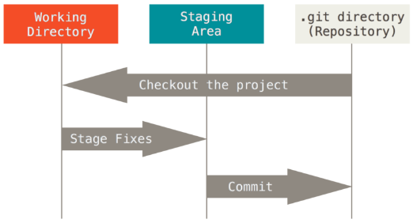

# Agenda

* Introdução GIT
* Instalação
* Configurando suas preferências
* Principais Repositórios
* Repositório local
* Repositório remoto
* Branches
* Referências
* Hands On

# Introdução

* Ebook: https://git-scm.com/book/en/v2

* Qual a necessidade de um sistemas de versionamento?
  - Como detectar que estamos alterando o mesmo código que um colega?
  - Como mesclar as alterações que fizemos com a demais alterações da equipe?
  - Como identificar conflitos entre essas alterações?

* GIT x SVN
  - Sistemas de versionamento centralizados
  - Sistemas de versionamento distribuídos

* Git e GitHub são as mesmas coisas?

* Como é de praxe:
  - GIT foi criado em 2005 por Linus Torvalds (criador do Linux)

# Principais Repositórios

* GitHub - Rede Social para programadores
* Bitbucket
* Google Code

# Instalação

* $ sudo apt-get install git

# Configurando suas preferências

## Sua identidade

* git config --global user.name "Danilo Paiva"

* git config --global user.email danilopaivasilva@gmail.com

## Seu editor

* git config --global core.editor vim

## Listar suas configurações

* git config --list

# Repositório local

## Criando um repositório local:

* git init

## Rastreando os arquivos:

* git status

## Adicionando um arquivo na área de Stage:

* git add

## Visualizando diferenças entre os arquivos rastreáveis e não rastreáveis

* git diff

## Ignorando alguns arquivos:

* .gitignore

## Gravando os arquivos no repositório:

* git commit -m <mensagem>

## Verificando o histórico do seu repositório:

* git log

## Desfazendo mudanças não rastreadas:

* git checkout -- "file"

## Desfazendo mudanças rastreadas:

* git reset -- "file"

## Desfazendo mudanças rastreadas mas voltando para o último commit:

* git reset --hard

## Desfazendo mudanças já comitadas:

* git revert --no-edit HEAD

# Repositório remoto

## Clonando um repositório remoto existente:

* git clone https://github.com/danilopaiva/products-service-inc.git

## Criando um repositório:

* git init

## Adicionando um repositório remoto:

* git remote add origin https://github.com/danilopaiva/minicurso-git-service.git

## Visualizando seus repositórios:

* git remote -v

## Renomeando seu repositório:

* git remote rename origin github

## Enviando os commits para o repositório remoto:

* git push origin "branch"

## Sincronizando o repositório local com o remoto:

* git pull origin "branch"

## Trazendo as informações do repositório remoto sem mesclar

* git fetch origin "branch"

# Branches

## Visualizando suas branches:

* git branch

* git branch -v

## Criando uma branch:

* git branch feature/x

## Trocando de branch:

* git checkout feature/x

## Visualizando as branches remotas:

* git branch -r

* git branch -a

## Realizando o merge entre duas branches:

* git checkout develop (Voltando para a branch develop)

* git merge feature/x -m "Mesclando com a branch feature/x"

# Hands On

* Para mais informações sobre o Hands On acesse o projeto: https://github.com/danilopaiva/minicurso-git-service

# Referências

* ProGit - https://git-scm.com/book/en/v2
* Git e GitHub - https://www.casadocodigo.com.br/products/livro-git-github

Vale muito apena ver o blog do Fernando Jorge que exemplifica bem o Git Flow: https://fjorgemota.com/git-flow-uma-forma-legal-de-organizar-repositorios-git/
